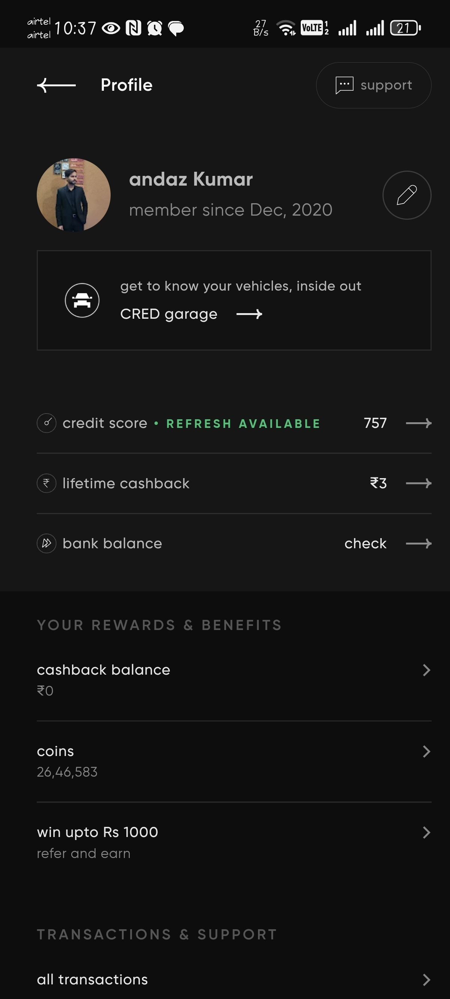
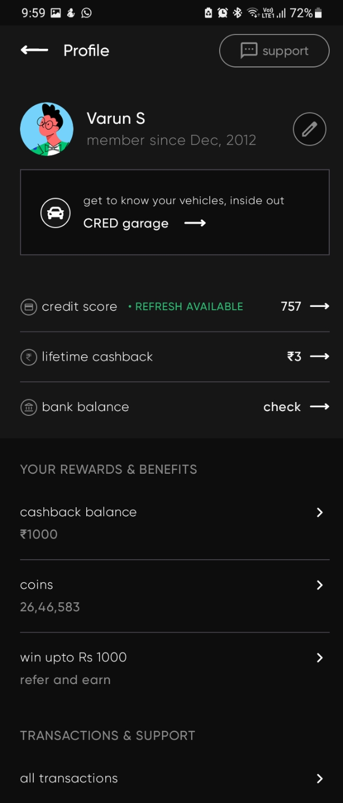

# Profile Activity Assignment

This repository contains my implementation of the Profile Activity UI as per the provided design reference for the internship assignment.

## Screenshots

### Reference Design

  

---

### My Implementation

  

## APK Download

You can directly download and test the app using the APK:  
[Download APK](./app-release.apk)

## Approach

- Built with **Jetpack Compose** for a modern, declarative UI experience.
- Used the **Gilroy** font for all primary text, matching the design.
- Where an icon was unavailable, I substituted a visually closest Google Material icon.
- All data is static and for demonstration only.

## How to Run (For Source Code)

1. Clone this repository.
2. Open in Android Studio.
3. Build and run the app on any emulator or device.
4. Fonts and all dependencies are included.

## Notes

- The design, layout, and fonts closely match the provided reference.
- The APK is provided for convenience.

---
